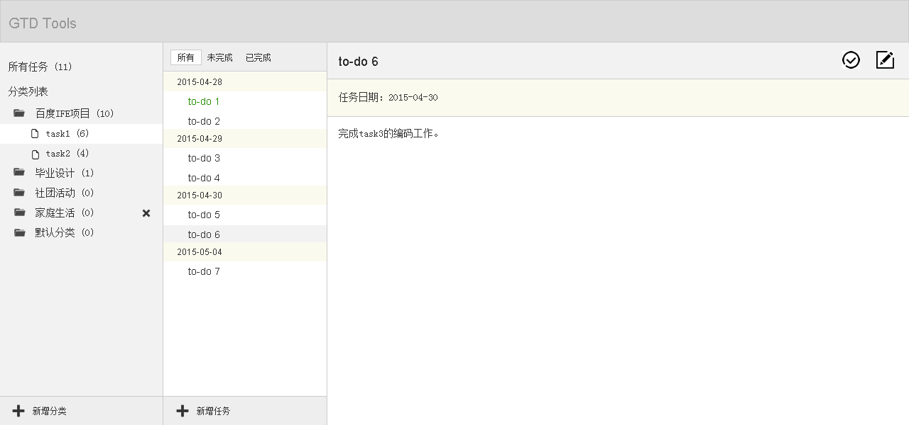

## exercise01
 **说明：**这个项目为官网的Todo项目，之前跟着教程将整个项目敲过一遍，但觉得还是很迷糊，又找资料学习，可能是自己理解有问题，觉得讲的都太笼统了，于是狠下心来，觉得还是要自己一个功能一个功能去自己实现下，当然不会的就会参考官网是怎么写的，代码基本上一样，不过现在实现这样一个类似的功能的东西还是没多大问题的。

## exercise02
 **说明：**一个跟Todo功能差不多的小练习,图是来自找backbone学习资料时在一篇博客中看到的，于是对照[这个图](http://w3cboy.com/post/2014/03/Backbone%E5%AE%9E%E6%88%98%E6%95%99%E7%A8%8B2/)，实现了一些功能，算是进一步熟练backbone。
 

## exercise03
**说明：**这个项目是百度前端学院的task0003任务，这个task0003任务之前是原生实现的，没有用任何框架，类库，在做完前两个小练习后，觉得backbone很好用，于是决定用backbone重新实现这个项目。
